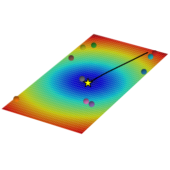
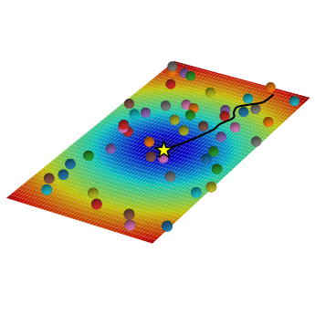
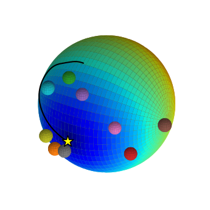
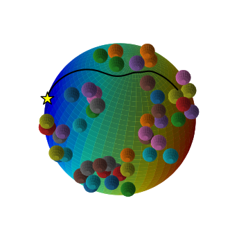

# Geometric Control
`geometric-control` uses Visitor Pattern with Variadic Template meta-programming strategy to generate an automatic sequence of connections' pullback, alias unconstrained inverse dynamics, across manifolds.
It generates tree structures where each is node is a different manifold.
The edges connecting nodes corresponds to maps across manifolds and they are parent/child node specific.
The leaf nodes consist of specific manifolds on which a connection (or covariant derivative) defines a ``task'', alias second-order DS accomplishing a specific goal.

  
  
  
  

  

At runtime all the connections are automatically pulled-back towards the root node generating an overall second-order DS encoding complex and various motions.
Multi-threading and templated structure allows for high modularity while maintaining operating frequencies above 1000Hz for the majority of the tasks.

## Tensor support
- https://scicomp.stackexchange.com/questions/11276/fast-lightweight-c-tensor-library-for-dimension-agnostic-code
- https://github.com/steven-varga/h5cpp/issues/44
- https://romanpoya.medium.com/a-look-at-the-performance-of-expression-templates-in-c-eigen-vs-blaze-vs-fastor-vs-armadillo-vs-2474ed38d982
- https://stackoverflow.com/questions/40829887/how-do-i-do-outer-product-of-tensors-in-eigen/49299922
- http://eigen.tuxfamily.org/dox-devel/unsupported/eigen_tensors.html